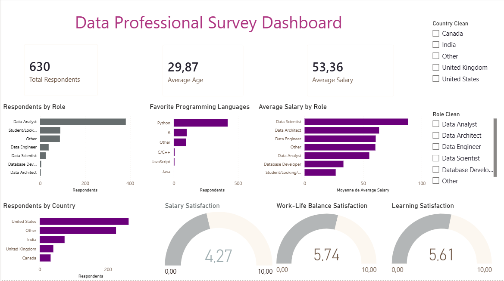

# Power BI Data Professional Survey Dashboard

## Project Overview
This project presents an interactive Power BI dashboard based on a survey of data professionals.  
The goal is to analyze respondent profiles, job roles, preferred programming languages, salary levels, countries, and job satisfaction scores.

## Tools Used
- Power BI Desktop
- Power Query
- Data cleaning and transformation
- Interactive dashboard design

## Dashboard Features
- Total number of respondents
- Average age
- Average salary
- Respondents by role
- Favorite programming languages
- Average salary by role
- Respondents by country
- Salary satisfaction
- Work-life balance satisfaction
- Learning satisfaction
- Interactive filters by country and role

## Data Cleaning
The dataset was cleaned using Power Query.  
Main transformations included:
- Renaming columns
- Cleaning job role categories
- Cleaning country values
- Cleaning programming language values
- Converting salary ranges into numerical average salary values
- Removing unnecessary columns
- Preparing satisfaction score fields for analysis

## Dashboard Preview

## Key Insights
- Data Analyst is the most represented role.
- Python is the most common programming language.
- Salary and satisfaction levels vary by role.
- The dashboard allows filtering by country and job role.

## Note
This project was created as a learning project to practice Power BI, Power Query, data cleaning, and dashboard creation.
